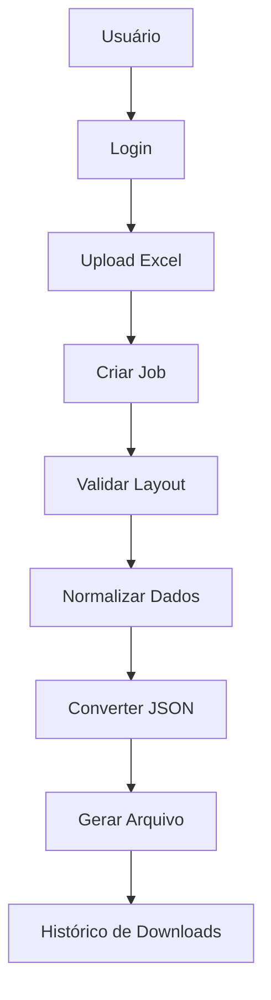

# 📊 Excel to JSON Converter

<div align="center">


Sistema web desenvolvido para automatizar o processamento de planilhas Excel, validação de layouts corporativos e conversão estruturada para JSON.

</div>

---

## 🚀 Sobre o Projeto

O **Excel to JSON Converter** é uma aplicação web desenvolvida em Flask com foco na automação do processamento de planilhas empresariais.

O sistema recebe arquivos Excel, valida layouts pré-definidos, realiza tratamento e normalização dos dados e gera arquivos JSON prontos para integração com outros sistemas.

### Principais Benefícios

✅ Redução de trabalho manual

✅ Padronização de dados

✅ Conversão automática para JSON

✅ Histórico de processamentos

✅ Rastreabilidade completa dos arquivos

✅ Controle de usuários e permissões

---

## 🎯 Funcionalidades

### 🔐 Autenticação

- Login
- Logout
- Sessão Persistente
- Controle de Permissões
- Proteção de Rotas
- Hash Seguro de Senhas (BCrypt)

### 📤 Upload de Arquivos

- Upload autenticado
- Validação de extensões
- Armazenamento seguro
- Nomeação automática por UUID
- Histórico de uploads

### ⚙️ Processamento

- Leitura de planilhas Excel
- Validação de layouts
- Tratamento de exceções
- Arquitetura modular
- Conversão estruturada para JSON

### 📈 Monitoramento

- Rastreamento de jobs
- Histórico de processamento
- Registro de falhas
- Status de execução

---

## 🛠️ Stack Tecnológica

### Backend

<p align="left">

</p>

### Banco de Dados

<p align="left">

</p>

### Processamento de Dados

- Pandas
- OpenPyXL

### Segurança

- Flask-Login
- BCrypt
- Flask Sessions

### Migrações

- Flask-Migrate
- SQLAlchemy

---

## 🏗️ Arquitetura

```text
excel_to_json/

├── app/
│
├── auth/
│   ├── routes.py
│   ├── service.py
│   └── forms.py
│
├── dashboard/
│   └── routes.py
│
├── uploads/
│   ├── routes.py
│   └── service.py
│
├── processing/
│   ├── validators.py
│   ├── normalizers.py
│   ├── exporters.py
│   └── excel_processor.py
│
├── models/
│   ├── user.py
│   └── conversion_job.py
│
├── core/
│   ├── config.py
│   ├── database.py
│   ├── security.py
│   ├── constants.py
│   └── exceptions.py
│
├── storage/
│   ├── uploads/
│   └── outputs/
│
├── migrations/
│
├── app.py
├── requirements.txt
└── README.md
```

---

## 🔄 Fluxo do Sistema



---

## 📋 Layout Atualmente Suportado

### Clientes

Campos obrigatórios:

| Campo |
|---------|
| Nome |
| CPF |
| Telefone |
| Email |

---

## 🗄️ Banco de Dados

### User

| Campo | Tipo |
|---------|---------|
| id | Integer |
| nome | String |
| email | String |
| senha_hash | String |
| role | String |
| ativo | Boolean |

### ConversionJob

| Campo | Tipo |
|---------|---------|
| id | Integer |
| user_id | Integer |
| filename | String |
| stored_filename | String |
| output_filename | String |
| status | String |
| records_processed | Integer |
| error_message | Text |
| created_at | DateTime |
| completed_at | DateTime |

---

## 🗺️ Roadmap

### ✅ Sprint 1 — Estrutura Inicial

- [x] Configuração Flask
- [x] Estrutura Modular
- [x] Banco de Dados

### ✅ Sprint 2 — Autenticação

- [x] Usuários
- [x] Login
- [x] Logout
- [x] Controle de Sessão
- [x] Controle de Permissões

### ✅ Sprint 3 — Processamento

- [x] ConversionJob
- [x] Upload Pipeline
- [x] Arquitetura de Processamento
- [x] Leitura de Excel
- [x] Validação de Layout

### 🚧 Sprint 3.5 — Normalização

- [ ] Normalização de CPF
- [ ] Normalização de Telefone
- [ ] Normalização de E-mail
- [ ] Remoção de Duplicados

### 🚧 Sprint 3.6 — Exportação

- [ ] Conversão JSON
- [ ] Atualização Automática de Jobs
- [ ] Histórico de Arquivos

### 🚧 Sprint 4 — Interface Web

- [ ] Dashboard
- [ ] Upload Interface
- [ ] Histórico de Processamentos

### 🚧 Sprint 5 — Administração

- [ ] Painel Administrativo
- [ ] Gestão de Usuários
- [ ] Logs de Auditoria

---

## 🚀 Futuras Melhorias

- Integração com APIs externas
- Processamento assíncrono com Celery
- Upload em lote
- Dashboard analítico
- Exportação CSV/XML
- Multiempresa
- Controle avançado de permissões

---

## 👨‍💻 Autor

**Felype Souza**

Desenvolvedor focado em automação, processamento de dados e desenvolvimento de sistemas web.

🔗 Linkedln: [https://www.linkedin.com/in/felype-souza-4391353a2/]

---

## 📄 Licença

Este projeto está licenciado sob a Licença MIT...
   
